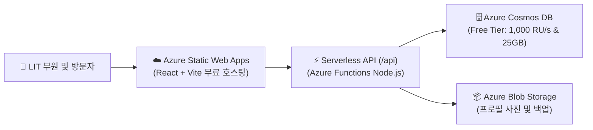

# LIT × MSA 250 Challenge - Azure for Students 무료 배포 및 DB 연동 가이드

경북대학교 IT 기술 발표 동아리 LIT의 MSA 250 챌린지 웹 플랫폼은 **Azure for Students** 구독의 **상시 무료 혜택(Free Tier)**을 활용하여 **운영 비용 0원**으로 배포 및 영구 서비스할 수 있도록 아키텍처가 완성되어 있습니다.

---

## 💡 Azure for Students 무료 혜택 요약

1. **$100 USD 무료 크레딧**: 가입 시 12개월간 사용 가능한 $100 크레딧 제공 (신용카드 등록 불필요).
2. **Azure Cosmos DB (NoSQL API) 평생 무료 (Free Tier)**:
   - 구독당 1개의 계정에 대해 **1,000 RU/s 처리량 + 25 GB 스토리지 평생 무료**.
   - 동아리 부원 수천 명, 클릭 수십만 건의 데이터를 초고속(10ms 미만)으로 처리해도 **비용 0원**.
3. **Azure Static Web Apps (Free Tier)**:
   - React + Vite 웹 프론트엔드 호스팅 무료.
   - GitHub Actions CI/CD 연동을 통한 커밋 시 자동 배포 무료.
   - 맞춤 도메인 2개 연결 및 무료 글로벌 SSL 인증서 자동 갱신.
   - 내장 Node.js 서버리스 API (`/api`) 지원.

---

## 🛠️ 아키텍처 구조

---

## 🚀 4단계 원클릭 무료 배포 가이드

### 1단계: Azure Cosmos DB (NoSQL) 무료 계층 생성
1. [Azure Portal (portal.azure.com)](https://portal.azure.com)에 대학교 학생 계정으로 로그인합니다.
2. 상단 검색창에 **Azure Cosmos DB**를 입력하고 **만들기(Create)**를 클릭합니다.
3. API 옵션 중 **Azure Cosmos DB for NoSQL**을 선택합니다.
4. 설정 항목:
   - **구독**: Azure for Students
   - **리소스 그룹**: `rg-lit-knu` (새로 만들기)
   - **계정 이름**: `cosmos-lit-knu` (소문자 및 숫자 조합)
   - **위치**: `Korea Central` 또는 `East Asia`
   - ⭐️ **Apply Free Tier Discount (무료 계층 할인 적용)**: 반드시 **적용(Apply)** 선택!
   - **용량 모드(Capacity mode)**: `프로비전된 처리량(Provisioned throughput)` 선택
5. **검토 + 만들기**를 눌러 데이터베이스를 배포합니다.
6. 배포 완료 후 리소스로 이동하여 좌측 **키(Keys)** 메뉴에서 아래 2가지 값을 복사해 둡니다:
   - `URI` (예: `https://cosmos-lit-knu.documents.azure.com:443/`)
   - `기본 키 (PRIMARY KEY)`

---

### 2단계: Azure Static Web Apps (SWA) 무료 생성
1. Azure Portal 검색창에 **정적 웹앱 (Static Web Apps)**을 입력하고 **만들기(Create)**를 클릭합니다.
2. 기본 사항 입력:
   - **구독**: Azure for Students
   - **리소스 그룹**: `rg-lit-knu`
   - **이름**: `lit-knu-web`
   - **플랜 유형**: ⭐️ **무료 (Free)**
   - **지역**: `East Asia`
3. 배포 세부 정보:
   - 원본: **GitHub** 선택 후 계정 로그인
   - 조직, 리포지토리: `LIT 웹` 저장소 선택
   - 분기(Branch): `main`
4. 빌드 세부 정보:
   - **빌드 사전 설정**: `Custom`
   - **앱 위치**: `/`
   - **API 위치**: `api`
   - **출력 위치**: `dist`
5. **검토 + 만들기**를 클릭합니다.

---

### 3단계: 환경변수 (애플리케이션 설정) 등록
1. 생성된 Azure Static Web Apps 리소스로 이동합니다.
2. 좌측 메뉴의 **구성 (Configuration)** → **애플리케이션 설정**을 클릭합니다.
3. **+ 추가(Add)**를 눌러 1단계에서 복사한 Cosmos DB 정보를 입력합니다:

| 이름 (Name) | 값 (Value) |
| :--- | :--- |
| `AZURE_COSMOS_DB_ENDPOINT` | `https://cosmos-lit-knu.documents.azure.com:443/` |
| `AZURE_COSMOS_DB_KEY` | `[1단계에서 복사한 기본 키]` |
| `AZURE_COSMOS_DB_DATABASE` | `LitMsaDatabase` |
| `AZURE_COSMOS_DB_CONTAINER` | `Members` |

4. 상단의 **저장(Save)** 버튼을 누르면 설정이 적용됩니다.

---

### 4단계: 배포 확인 및 나만의 도메인 접속
1. 코드를 GitHub `main` 브랜치에 푸시하면 `.github/workflows/azure-static-web-apps.yml` 워크플로우가 자동으로 실행되어 1~2분 내에 빌드 및 배포를 마칩니다.
2. Azure Static Web Apps 개요 페이지에 표시된 **URL** (예: `https://white-cliff-012345.azurestaticapps.net`)을 클릭하여 접속합니다.
3. 우측 상단 내비게이션 바의 **[Azure DB]** 버튼을 눌러 **연결 테스트**를 수행하면 클라우드 DB 연동 완료 메시지를 확인할 수 있습니다!

---

## 🖥️ 웹 앱 내 '클라우드 DB 계정 관리' 기능

우측 상단 **[Azure DB]** 버튼을 클릭하면 다음 기능들을 자유롭게 이용할 수 있습니다:

1. **🗄️ 부원 계정 DB 관리 테이블**:
   - 프로필 사진, 이름, 아이디(@handle), 전공, 역할, Contributor ID, MS 자격증, 클릭수를 한눈에 확인.
   - **[수정]**: 부원 정보, 프로필 사진, 클릭수(0~250)를 즉시 수정.
   - **[삭제]**: 퇴사 또는 미활동 계정을 데이터베이스에서 즉각 영구 삭제.
   - **[+ 신규 부원 DB 등록]**: 관리자 권한으로 부원 계정을 데이터베이스에 직접 추가.
2. **☁️ 클라우드 DB 전체 동기화 (Bulk Sync)**:
   - 로컬에서 작업한 부원 명단과 아티클 전체를 Azure Cosmos DB로 원클릭 백업.
3. **💾 JSON 백업 & 복원**:
   - 안전한 오프라인 JSON 파일로 언제든지 다운로드 및 복원 가능.

---

## 🎓 운영 팁
- **LIT 운영진 대표 계정**: 아이디 `LIT` / 비밀번호 `1234`
- 일반 부원 계정은 기본 비밀번호 `1234`로 설정되어 있으며, 프로필 수정 모달에서 각자 새 비밀번호로 변경할 수 있습니다.
